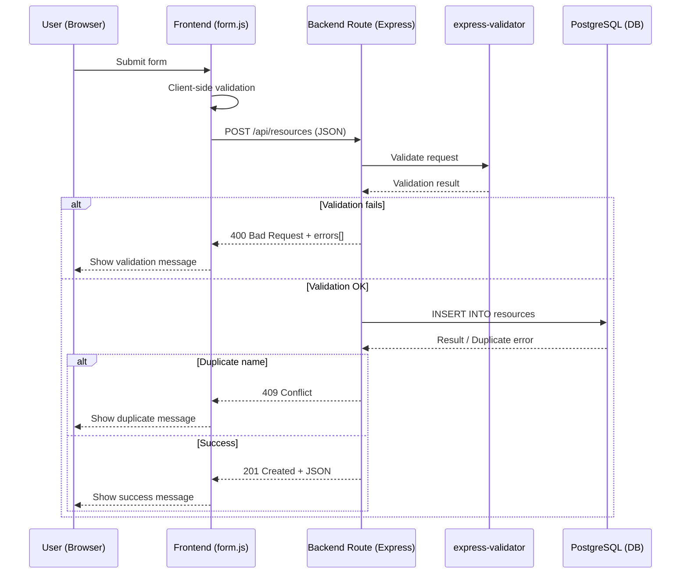
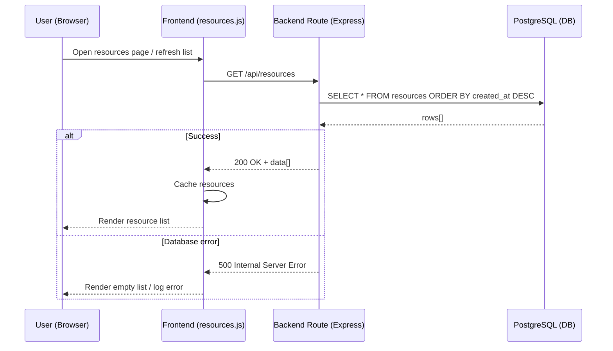
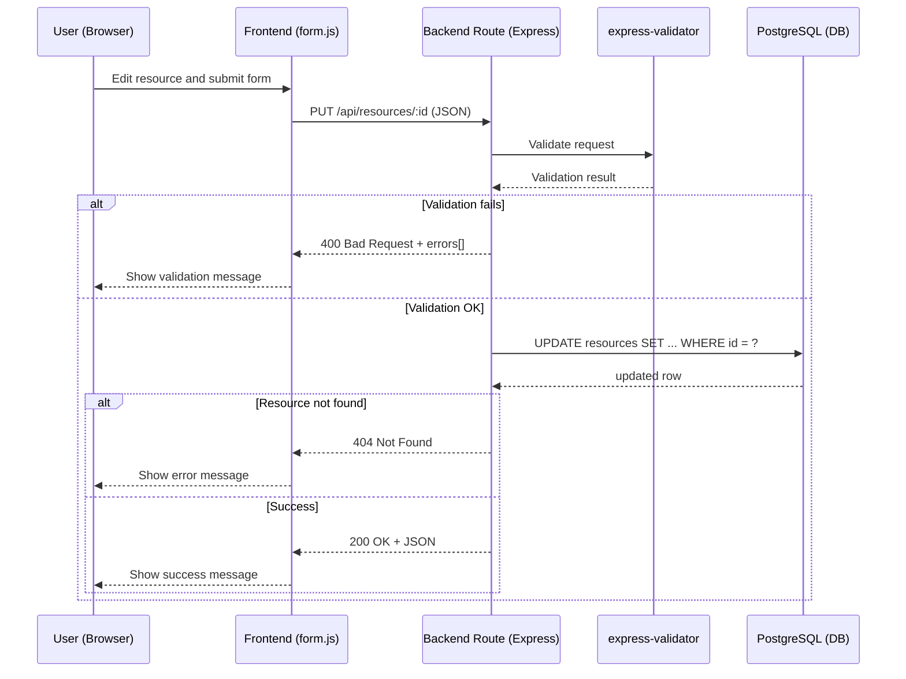
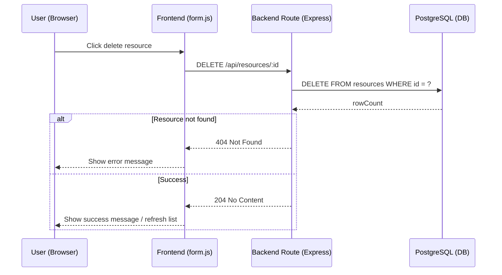

# G1_CRUD_DataFlow

```mermaid
sequenceDiagram
    participant U as User (Browser)
    participant F as Frontend (form.js)
    participant B as Backend Route (Express)
    participant V as express-validator
    participant DB as PostgreSQL (DB)

    U->>F: Submit form
    F->>F: Client-side validation
    F->>B: POST /api/resources (JSON)

    B->>V: Validate request
    V-->>B: Validation result

    alt Validation fails
        B-->>F: 400 Bad Request + errors[]
        F-->>U: Show validation message
    else Validation OK
        B->>DB: INSERT INTO resources
        DB-->>B: Result / Duplicate error

        alt Duplicate name
            B-->>F: 409 Conflict
            F-->>U: Show duplicate message
        else Success
            B-->>F: 201 Created + JSON
            F-->>U: Show success message
        end
    end
```

```mermaid
sequenceDiagram
    participant U as User (Browser)
    participant F as Frontend (resources.js)
    participant B as Backend Route (Express)
    participant DB as PostgreSQL (DB)

    U->>F: Open resources page / refresh list
    F->>B: GET /api/resources

    B->>DB: SELECT * FROM resources ORDER BY created_at DESC
    DB-->>B: rows[]

    alt Success
        B-->>F: 200 OK + data[]
        F->>F: Cache resources
        F-->>U: Render resource list
    else Database error
        B-->>F: 500 Internal Server Error
        F-->>U: Render empty list / log error
    end
```

```mermaid
sequenceDiagram
    participant U as User (Browser)
    participant F as Frontend (form.js)
    participant B as Backend Route (Express)
    participant V as express-validator
    participant DB as PostgreSQL (DB)

    U->>F: Edit resource and submit form
    F->>B: PUT /api/resources/:id (JSON)

    B->>V: Validate request
    V-->>B: Validation result

    alt Validation fails
        B-->>F: 400 Bad Request + errors[]
        F-->>U: Show validation message
    else Validation OK
        B->>DB: UPDATE resources SET ... WHERE id = ?
        DB-->>B: updated row

        alt Resource not found
            B-->>F: 404 Not Found
            F-->>U: Show error message
        else Success
            B-->>F: 200 OK + JSON
            F-->>U: Show success message
        end
    end
```

```mermaid
sequenceDiagram
    participant U as User (Browser)
    participant F as Frontend (form.js)
    participant B as Backend Route (Express)
    participant DB as PostgreSQL (DB)

    U->>F: Click delete resource
    F->>B: DELETE /api/resources/:id

    B->>DB: DELETE FROM resources WHERE id = ?
    DB-->>B: rowCount

    alt Resource not found
        B-->>F: 404 Not Found
        F-->>U: Show error message
    else Success
        B-->>F: 204 No Content
        F-->>U: Show success message / refresh list
    end
```
